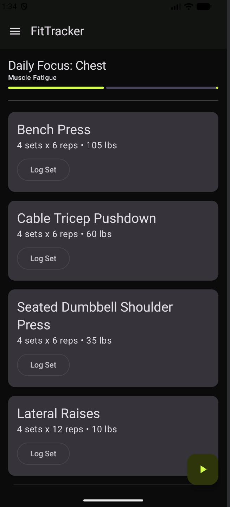

# FitTracker: Responsive Workout App (Q4 Challenge)

### 📝 Project Overview
This project demonstrates a fully responsive "Adaptive Layout" for a fitness tracking application. Using a single codebase, the app intelligently reorganizes its interface based on screen width, providing an optimized experience for both mobile and tablet/large-screen devices.

### 🚀 Adaptive Layout Logic
The application uses a **600dp breakpoint** (Industry Standard) inside a `BoxWithConstraints` to toggle between two distinct UI architectures:

1. **Phone Mode (Narrow Screens)**:
   * **Layout**: Single-pane vertical `Column`.
   * **Navigation**: Implements a `ModalNavigationDrawer` with a "hamburger" menu to save screen real estate.
   * **Components**: Utilizes a `Scaffold` with a `FloatingActionButton` (FAB) for primary workout actions.

2. **Tablet Mode (Wide Screens)**:
   * **Layout**: Dual-pane horizontal `Row`.
   * **Navigation**: Implements a permanent `NavigationRail` for instant access to top-level sections.
   * **Dual Pane**: Features a persistent "Muscle Groups" sidebar (`Column`) alongside the detailed workout content (`Box` + `Column`).

### 🎨 Material 3 Requirements Met
The following 8 M3 components were implemented to satisfy the project rubric:
1.  **NavigationRail**: Permanent side-nav optimized for tablets.
2.  **ModalNavigationDrawer**: Hideable side-nav for phone portability.
3.  **NavigationDrawerItem**: Interactive items inside the mobile drawer.
4.  **ListItem**: Provides structured list data for the Muscle Groups sidebar.
5.  **LinearProgressIndicator**: Displays "Muscle Fatigue" statistics.
6.  **Card**: Groups individual exercise logging details.
7.  **FloatingActionButton (FAB)**: Central action point for starting workouts on mobile.
8.  **TopAppBar**: Contextual header providing screen titles and drawer access.

### 🛠️ Modifiers Demonstrated
* **`weight(1f)`**: Used in Tablet mode to ensure the detail pane expands to fill all remaining horizontal space next to the sidebar.
* **`fillMaxHeight()`**: Applied to the NavigationRail and sidebar to ensure they span the full vertical height of the tablet screen.
* **`verticalScroll(scrollState)`**: Implemented in the reusable `ExerciseDetailContent` to handle long lists of workout cards on any device size.
* **`BoxWithConstraints` Scope**: Used to access `maxWidth` for real-time layout switching.

---

### 📱 Execution Environment
* **Device**: Pixel 8 Pro (Phone) & Pixel Tablet (Tablet)
* **SDK Version**: Android 36 (targetSdk)
* **Min SDK**: 26
* **Compose BOM**: 2026.01.00

### 📸 Screenshots

| Phone Layout (Single Pane) | Tablet Layout (Dual Pane) |
| :--- | :--- |
|  |  |
